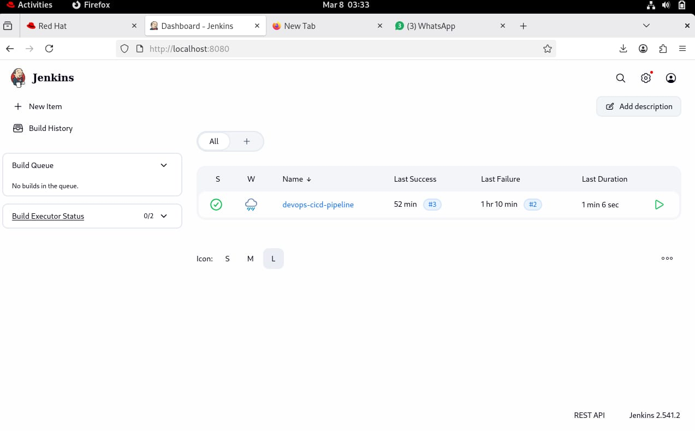
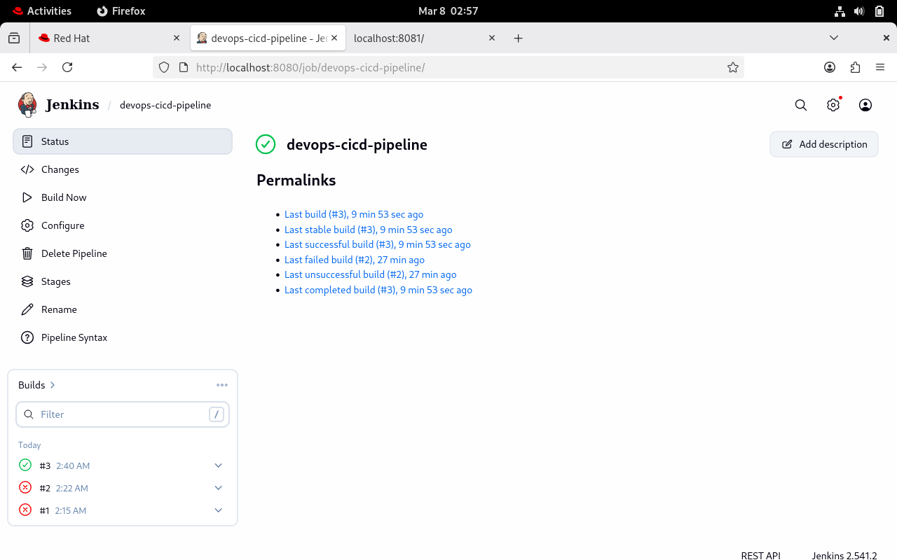
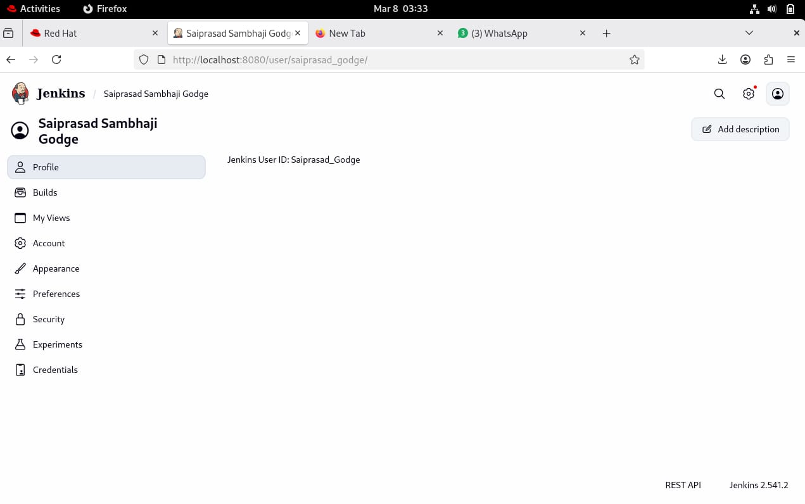
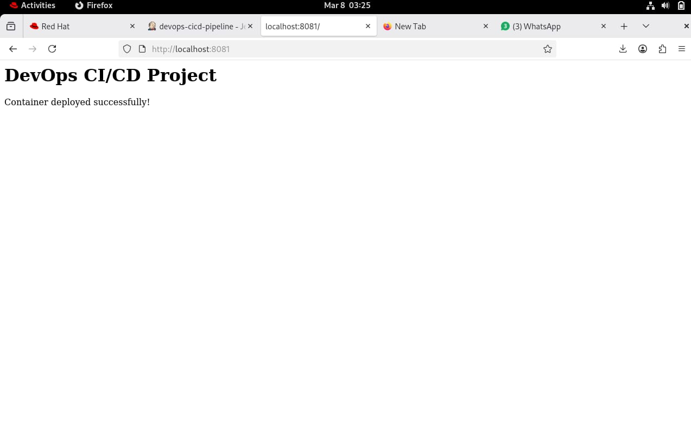

# DevOps CI/CD Pipeline Project

## Overview
This project demonstrates a CI/CD pipeline built using Jenkins and Podman.

## Architecture

---
        ┌───────────────┐
        │   Developer   │
        └───────┬───────┘
                │ git push
                ▼
        ┌───────────────┐
        │     GitHub    │
        │   Repository  │
        └───────┬───────┘
                │ trigger
                ▼
        ┌───────────────┐
        │    Jenkins    │
        │   CI/CD Job   │
        └───────┬───────┘
                │
        ┌───────▼────────┐
        │ Clone Source    │
        │ Build Image     │
        │ Run Container   │
        └───────┬────────┘
                │
                ▼
        ┌───────────────┐
        │  Podman       │
        │ Container     │
        └───────┬───────┘
                │
                ▼
        ┌───────────────┐
        │  Web App      │
        │ localhost:8081│
        └───────────────┘


## Tools Used
- Jenkins
- Podman
- GitHub
- Linux
- Nginx

## Project Structure

```
devops-cicd-project
│
├── app/
│   ├── index.html
│   └── style.css
│
├── Dockerfile/Containerfile
│
├── Jenkinsfile
│
├── screenshots/
│   ├── jenkins-pipeline.png
│   ├── console-output.png
│   └── deployed-app.png
│
└── README.md
```

## Application 🌐

The application is deployed using a container built with Podman and served via Nginx.

Accessible at:

http://localhost:8081

---

### Run the application manually

1. Clone the repository

```bash
git clone https://github.com/SAI-GODGE/devops-cicd-project.git
cd devops-cicd-project
```
2. Build the container image

```bash
podman build -t devops-webapp .
```
3. Run the container

```bash
podman run -d -p 8081:80 devops-webapp
```
4. Open in browser

```bash
http://localhost:8081
```

# Project Screenshots 📸

### Jenkins Dashboard


---

### Jenkins Pipeline Success


---

### Jenkins User Profile


---

### Application Deployment


---


